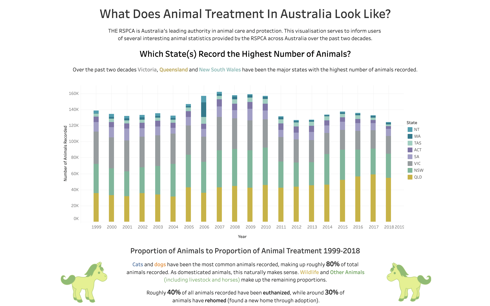
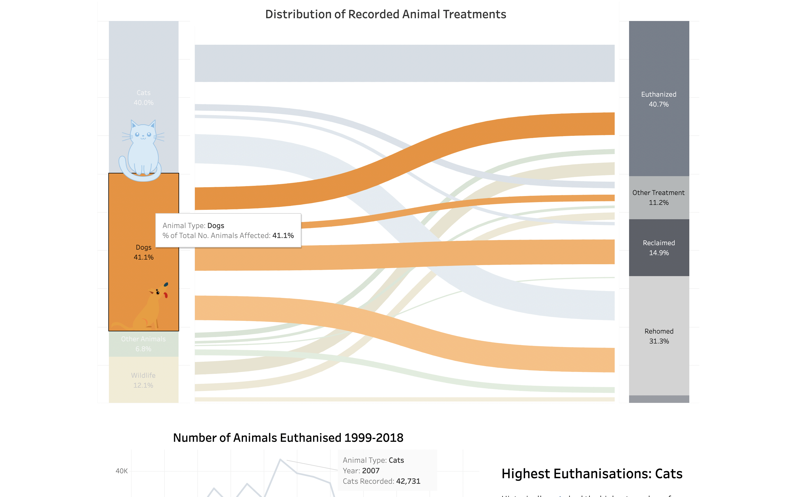

# RSPCA Data Visualisation
This visualisation serves to inform users of several interesting animal statistics provided by the RSPCA across Australia over the past two decades.

Live at: [https://public.tableau.com/app/profile/nixon.uch/viz/Assignment1_16302218436010/WhatDoesAnimalTreatmentInAustraliaLookLike?publish=yes](https://public.tableau.com/app/profile/nixon.uch/viz/Assignment1_16302218436010/WhatDoesAnimalTreatmentInAustraliaLookLike?publish=yes)

 

